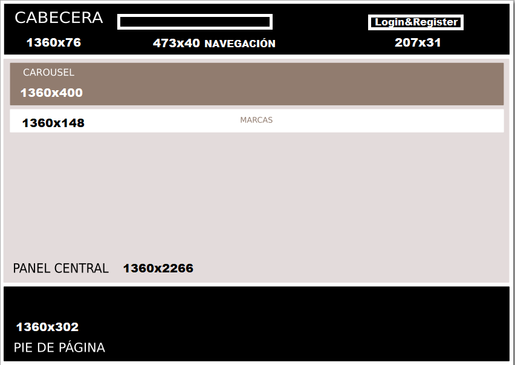

- [TÍTULO DE PROYECTO](#título-de-proyecto)
  - [Antecedentes](#antecedentes)
- [REQUISITOS](#requisitos)
  - [Requisitos funcionales](#requisitos-funcionales)
- [ANÁLISIS Y DISEÑO WEB](#análisis-y-diseño-web)
  - [Guía de estilos](#guía-de-estilos)
  - [Prototipo web y boceto de la estructura](#prototipo-web-y-boceto-de-la-estructura)
  - [Planificación de tareas](#planificación-de-tareas)
  - [Base de datos](#base-de-datos)
    - [Diseño Entidad Relación de la BBDD](#diseño-entidad-relación-de-la-bbdd)
    - [Modelo relacional BBDD](#modelo-relacional-bbdd)
    - [Script de creación BBDD](#script-de-creación-bbdd)
    - [Consultas](#consultas)
  - [Validación de formularios](#validación-de-formularios)
  - [Jerarquía de directorios](#jerarquía-de-directorios)
    - [Contenido directorios](#contenido-directorios)
  - [Diseño de la interface](#diseño-de-la-interface)
    - [Estructura gráfica de la interface](#estructura-gráfica-de-la-interface)
- [PRUEBAS](#pruebas)
  - [Diseño de casos de prueba](#diseño-de-casos-de-prueba)
  - [Implementación de pruebas](#implementación-de-pruebas)
  - [Análisis de resultados](#análisis-de-resultados)
- [DESPLIEGUE](#despliegue)
- [HERRAMIENTAS](#herramientas)
- [LENGUAJES](#lenguajes)
- [PRODUCTO](#producto)
  - [Página de Inicio](#página-de-inicio)
- [BIBLIOGRAFÍA](#bibliografía)

# TÍTULO DE PROYECTO
## Antecedentes

Este proyecto muestra todos los pasos a seguir para recolectar, organizar, tratar y construir un portal Web empezando desde cero, que tiene como objetivo brindar una solución innovadora para las personas que buscan mantenerse en forma y llevar un estilo de vida saludable. La aplicación web estará enfocada en proporcionar a los usuarios una amplia variedad de ejercicios y estadísticas personalizadas para ayudarlos a alcanzar sus objetivos de acondicionamiento físico. La aplicación también se diseñará con un enfoque en la experiencia del usuario y la facilidad de uso, asegurando una navegación intuitiva y una interfaz atractiva. El proyecto se desarrollará utilizando tecnologías modernas y escalables, con un enfoque en la seguridad y la estabilidad de la plataforma.

Se han utilizado distintos lenguajes de programación, como pueden ser PHP y JavaScript para su desarrollo, que permiten el desarrollo de una plataforma escalable, segura y de fácil mantenimiento. Además, se ha hecho uso de diferentes tecnologías y herramientas como bases de datos MySQL para el almacenamiento de información.

Para el diseño de la aplicación web, se han utilizado herramientas como Photoshop para la creación de diseños gráficos, Chart.js una biblioteca JavaScript gratuita de código abierto para la visualización de datos y CSS para la creación de una interfaz de usuario atractiva y personalizada. También se han aplicado técnicas de diseño responsive, lo que significa que la aplicación web es fácilmente accesible desde dispositivos móviles y se adapta a diferentes tamaños de pantalla. Todo esto con el objetivo de proporcionar una experiencia de usuario óptima y una aplicación web funcional.

# REQUISITOS

Se describen de forma concisa los requisitos funcionales de vuestra aplicación.
## Requisitos funcionales

Se enumeran todos los requisitos funcionales de vuestra aplicación. Descripción detallada de cada requisito, incluyendo su funcionamiento, validaciones si fuesen necesarias, y cualqier información relevante.
- Registro de usuarios:

    - Registrar un usuario con datos válidos y asegúrate de que el registro se realice correctamente. Verifica que los datos se guarden correctamente en la base de datos. 
Inicia sesión con las credenciales del usuario registrado y luego verificar en la base de datos que los datos están registrados.

- Inicio de sesión:

    - Iniciar sesión con un usuario registrado en la base de datos e introducir las credenciales correctas.

- Registros de estadísticas: 

    - Ingresa datos válidos de estadísticas y verificar que se han registrado correctamente en la base de datos

- Soporte multiplataforma:

    - La interfaz de usuario y el diseño deben adaptarse a diferentes tamaños de pantalla y resoluciones con la utilización de tecnologías y frameworks multiplataforma.

- Instrucciones de entrenamiento:

    - Introducción de datos a la base de datos y programarlo para que se visualice en la página las instrucciones de los ejercicios detalladamente.

- Restringiendo el acceso a las páginas:

    - Los usuarios no autenticados deben ser redirigidos a una página de inicio de sesión cuando intenten acceder a áreas restringidas.

- Base de datos de ejercicios:

    - La aplicación debe incluir una base de datos de ejercicios que incluya información detallada sobre cómo realizar cada ejercicio, el equipo necesario y la técnica adecuada.

- Gestión de datos de perfil:

    - Los usuarios deben poder ver y editar su perfil de usuario, incluyendo información personal como nombre, apellidos, fecha de nacimiento, peso, altura, provincia, etc.

- Programas de entrenamiento preestablecidos: 

    - Incluye programas de entrenamiento preestablecidos con descripción y los ejercicios y series por hacer.

- Administración de ejercicios:

    - El usuario administrador del sitio web debe tener la capacidad de agregar, editar y eliminar ejercicios disponibles en la plataforma.

- Registro de usuarios: Hecho
- Inicio de sesión: Hecho
- Registros de estadísticas: Hecho
- Soporte multiplataforma: Hecho
- Instrucciones de entrenamiento: Hecho
- Restringiendo el acceso a las páginas: Hecho
- Base de datos de ejercicios: Hecho
- Gestión de datos de perfil: Hecho
- Programas de entrenamiento preestablecidos: Hecho
- Administración de ejercicios: Hecho

# ANÁLISIS Y DISEÑO WEB

## Guía de estilos

Colores corporativos

Los colores corporativos seleccionados para el proyecto son diferentes tipos de tonos de azul, el blanco y el negro. Estos colores se eligieron cuidadosamente por las siguientes razones:

- El azul oscuro transmite confianza, profesionalismo y estabilidad. Es un color que evoca seriedad, seguridad y fuerza, lo cual es importante en una aplicación relacionada con el ejercicio y la salud.
- Combinación atractiva y armoniosa: La combinación del azul oscuro y el negro oscuro genera un contraste equilibrado y agradable a la vista. Estos colores complementarios se destacan visualmente.

## Prototipo web y boceto de la estructura

## Planificación de tareas

## Base de datos
### Diseño Entidad Relación de la BBDD

Realizamos el Esquema Entidad Relación de la BBDD de nuestra aplicación.

### Modelo relacional BBDD

### Script de creación BBDD

https://drive.google.com/file/d/14fbDgUxlYxiRzcvyncd38TPbnFwQzvpJ/view?usp=share_link

### Consultas 

## Validación de formularios

Formulario de registro de usuario:

- Validación de campo requerido: asegurarse de que los campos obligatorios, como nombre y apellidos, correo electrónico, contraseña, fecha de nacimiento, peso y altura, provincia y población no estén vacíos. 
- Validación de formato de correo electrónico: verificar si la dirección de correo electrónico proporcionada sigue un formato válido. Validación de contraseña: asegurarse de que las contraseñas coinciden.

Formulario de inicio de sesión:

- Validación de formato correo electrónico: se especifica el atributo “required” en el campo de entrada de email, lo que indica que este campo debe ser completado. 
- Validación de contraseña: se especifica el atributo “required” en el campo de entrada de email, lo que indica que este campo debe ser completado. 
- Validación de contraseña: con password_verify verifica que la contraseña ingresada con la contraseña almacenada en la base de datos. Validación de usuario: Verifica
si el usuario es administrador (admin@admin.com) te lleva a la página administrador o de lo contrario si es un usuario normal te redirige al Inicio. 
- Validación del método de solicitud: El código verifica si el método de solicitud utilizado es POST mediante la comprobación de $_SERVER['REQUEST_METHOD'] === 'POST'. Esto asegura que el código se ejecute sólo cuando se envía el formulario mediante el método POST. 
- Validación de mensajes de error: Si se encuentra un error en el proceso de autenticación, se asigna un mensaje de error a $_SESSION["mensajeError"]. Luego, se redirige al usuario de vuelta a la página de inicio de sesión para mostrar el mensaje de error correspondiente.

Formulario de ingreso de estadísticas: 

- Validación de campos: Se especifica el atributo “required” en el campo de entrada de fecha, calorías y masa muscular lo que indica que este campo debe ser completado. 
- Validación de usuario: Antes de mostrar el botón de envío del formulario, se verifica si el usuario ha iniciado sesión. Si $_SESSION['id_usuario'] está definido, se muestra el botón de envío. De lo contrario, se muestra un mensaje indicando que el usuario debe iniciar sesión para ingresar las estadísticas. 
- Validación de existencia de estadísticas: Se realiza una consulta para verificar si el usuario ya tiene estadísticas registradas en la tabla "estadísticas" utilizando el ID de usuario. Si se encuentra algún registro, se prepara una consulta de actualización UPDATE para actualizar los datos existentes. De lo contrario, se prepara una consulta de inserción INSERT para insertar los nuevos datos.

Formulario del perfil del usuario

- Validación del campo de imagen: El formulario utiliza el atributo enctype="multipart/form-data" para permitir la carga de archivos, y se incluye un campo de entrada de tipo file con el nombre "imagen_perfil". Esto implica que el campo de imagen es obligatorio y se requerirá que el usuario seleccione un archivo antes de enviar el formulario. 
- Validación de almacenamiento de datos previos: En los campos de entrada de texto se muestran los valores actuales de los campos "nombre", "apellidos", "fechaNacimiento", "altura", "peso", "provincia" y "poblacion". 
- Verificación de campos de texto: Inicialmente los campos aparecen vacíos, por lo que no se realizan validaciones para garantizar que se ingresen datos válidos. Esto podría implicar que los campos no son obligatorios y se permite que el usuario los deje en blanco.

Formulario de datos administrador

- Crear Usuario y Ejercicio

    - Verificación de inicio de sesión: Verifica si se ha iniciado sesión y si el usuario tiene el correo electrónico "admin@admin.com". Si no se ha iniciado sesión o el correo electrónico no coincide, se redirige al usuario a la página de inicio de sesión.
    - Redirección después de la inserción: Después de la inserción exitosa en la base de datos, se redirige al usuario a la página admin.php.
required: Todos los campos del formulario tienen el atributo required, lo que significa que el usuario debe completarlos antes de enviar el formulario. Esto garantiza que no se envíen valores vacíos.
    - Validaciones del correo electrónico: Con type=”email” válida que el valor ingresado sea una dirección de correo electrónico válida. 
Validaciones de contraseña: Con type="password" oculta los caracteres ingresados para proteger la privacidad del usuario. 
    - Validaciones de fecha: Con type="date" muestra un calendario desplegable para que el usuario seleccione una fecha válida.
    - Validación de número: Con type="number"  limita la entrada a solo números. Esto asegura que se ingresen valores numéricos válidos.

- Editar Usuario y Ejercicio

  - Validación de campos: Se especifica el atributo “required” en el campo de entrada lo que indica que este campo debe ser completado.
  - Validación de extensión en la imagen: El campo de imagen tiene el atributo accept establecido como .jpg, .jpeg, .png. Esto indica al navegador que solo permite seleccionar archivos con esas extensiones.
  - Validación de valores establecidos: Los campos tienen el atributo value establecido con valores provenientes de la variable $ejercicio o $usuario. Esto muestra los valores actuales en los campos del formulario, lo que permite al usuario editarlos y guardar los cambios.
  - Verificación de inicio de sesión: Se verifica si el usuario ha iniciado sesión y si su correo electrónico coincide con "admin@admin.com". Si no se cumple esta condición, se redirige al usuario a la página de inicio de sesión.

## Jerarquía de directorios

### Contenido directorios

> ./  En el directorio raíz tenemos el Inicio.php y style.css
 
> admin-> Contiene el panel de administrador y archivos editables, actualizables y eliminables.

> Auxiliares-> Aquí están las conexiones de la base de datos, del login, el logout y el registro.

> Entrenamiento-> Contiene los ejercicios y entrenamientos

> formulario-> Contiene los formularios

> fotos-> Contiene las fotos de la aplicación web

> js-> Contiene los archivos de javaScript del chart.js, IMC.js y ScrollNav.js

> Navegación-> Contiene los elementos de la barra de navegación

> usuario-> Contiene el perfil y los archivos para que funciones

## Diseño de la interface

El sitio web consta de cuatro partes fundamentales.

Header: Contiene el logo de la empresa, el menú de navegación el inicio de sesión y registro y una vez logueado el usuario contiene el perfil y el log out. 

Body: Es la parte más importante de la aplicación web. Aquí se incluye el contenido, como la información, los textos, las imágenes u otros elementos de la empresa.

Footer: Es la sección inferior del sitio web que contiene información de contacto como el email, el teléfono y la dirección. Incluye el copyright más abajo.

Menú de navegación: Es un conjunto de enlaces que permiten a los usuarios moverse por diferentes páginas. Esta barra de navegación incluye el inicio, el entrenamiento, estadísticas, sobre nosotros y contacto.

### Estructura gráfica de la interface

# PRUEBAS

El objetivo de las pruebas es garantizar que la aplicación sea confiable, segura, eficiente y fácil de usar para los usuarios. El proceso de pruebas los vamos a dividir en tres etapas:

- Diseño de casos de prueba
- Implementación de pruebas
- Análisis de resultados

## Diseño de casos de prueba

Nombre del caso de prueba: Inicio de sesión exitoso

Descripción: El objetivo de este caso de prueba es verificar que un usuario pueda iniciar sesión en la aplicación web de manera exitosa utilizando sus credenciales de inicio de sesión.

Precondiciones:
  - El usuario debe tener una cuenta válida en la aplicación web.
  - El usuario debe tener un correo electrónico y contraseña válidos.
Pasos:
  - Navegar a la página de inicio de sesión de la aplicación web.
  - Ingresar el correo electrónico del usuario en el campo "Correo electrónico". 
  - Ingresar la contraseña del usuario en el campo "Contraseña".
  - Hacer clic en el botón "Iniciar sesión".
Resultados esperados:
  - La aplicación web debe validar las credenciales del usuario y permitir el acceso a la página principal de la aplicación.
  - El usuario debe ser redirigido a la página principal de la aplicación web.
Condiciones de aprobación:
  - Si la aplicación web valida las credenciales del usuario y permite el acceso a la página principal de la aplicación, el caso de prueba se considera aprobado.
  - Si la aplicación web no valida las credenciales del usuario o no permite el acceso a la página principal de la aplicación, el caso de prueba se considera fallido.

Nombre del caso de prueba: Registro de usuario exitoso

Descripción: El objetivo de este caso de prueba es verificar que un usuario pueda registrarse en la aplicación web de manera exitosa.
Precondiciones:
  - El usuario accede a la página de registro de la aplicación web.
Pasos:
  - Abrir la página de registro de usuario. 
  - Completar los campos requeridos del formulario de registro, como nombre, apellido, correo electrónico, contraseña, altura, peso, provincia y población. 
  - Hacer clic en el botón "Registrar". 
  - Verificar que no se muestren mensajes de error y que el sistema confirme el registro exitoso. 
  - Iniciar sesión utilizando las credenciales proporcionadas durante el registro. 
  - Verificar que se dirija correctamente al usuario a la página de inicio o al panel de control del sistema. 
  - Comprobar que el nombre del usuario se muestre en la pantalla de bienvenida o en algún lugar visible para confirmar que se ha iniciado sesión correctamente.
Resultados esperados:
  - No se deben mostrar mensajes de error durante el proceso de registro. 
  - El sistema debe confirmar el registro exitoso del usuario. 
  - El usuario debe poder iniciar sesión con las credenciales proporcionadas durante el registro. 
  - Después de iniciar sesión, el usuario debe ser redirigido correctamente a la página de inicio o al panel de control del sistema. 
  - El nombre del usuario debe mostrarse de manera visible para confirmar que se ha iniciado sesión correctamente.
Condiciones de aprobación:
  - Si la aplicación web valida las credenciales del formulario de registro y permite el acceso a la página de inicio de sesión sin ningún error el caso de prueba se considera aprobado.
  - Si la aplicación web no valida las credenciales del registro, el caso de prueba se considera fallido.

Nombre del caso de prueba: Ingreso de estadísticas exitoso 
Descripción: Verificar que las estadísticas se ingresen correctamente en la base de datos. 
Precondiciones:
  - El usuario ha iniciado sesión correctamente en el sistema.
  - Existe un ejercicio válido al cual se desea ingresar las estadísticas. 
  - El usuario tiene los datos necesarios para ingresar las estadísticas, como la fecha, las calorías quemadas y la masa muscular. 
  - El sistema proporciona un formulario o interfaz adecuada para ingresar las estadísticas del ejercicio.
  - No existen restricciones previas que impidan el ingreso de las estadísticas, como límites de tiempo o reglas específicas establecidas por el sistema.
Pasos: 
  - Acceder al formulario de ingreso de estadísticas. 
  - Completar los campos requeridos del formulario, como fecha, calorías quemadas y masa muscular. 
  - Enviar el formulario para guardar las estadísticas. 
  - Realizar una consulta a la base de datos para verificar que las estadísticas se hayan guardado correctamente. 
  - Comparar los valores ingresados en el formulario con los valores obtenidos de la base de datos. 
Resultado esperados: 
  - Las estadísticas se guardan correctamente en la base de datos. 
  - Los valores ingresados en el formulario coinciden con los valores obtenidos de la base de datos. 
Condiciones de aprobación:
  - No se producen errores durante el proceso de ingreso de las estadísticas. 
  - Los valores ingresados en el formulario coinciden exactamente con los valores obtenidos de la base de datos. 

Nombre del caso de prueba: Ingreso de datos del perfil del usuario exitoso 

Descripción: Este caso de prueba evalúa el proceso de ingreso de datos del perfil del usuario y verifica que los datos se ingresen correctamente y actualicen en la base de datos.

Precondiciones: 
  - El usuario ha iniciado sesión en su cuenta. 
  - El usuario tiene acceso al formulario de su perfil. 
Pasos: 
  - El usuario accede al formulario de edición del perfil.
  - El usuario ingresa los datos en los campos correspondientes, como nombre, apellidos, fecha de nacimiento, altura, peso, provincia, población y la imagen de perfil.
  - El usuario guarda los cambios realizados en el perfil. 
Resultado esperado: 
  - Los datos del perfil del usuario se ingresan correctamente en los campos correspondientes. 
  - Al guardar los cambios, los datos del perfil se actualizan en el sistema sin errores.
  - Al visualizar el perfil actualizado, los datos ingresados previamente se muestran correctamente. 
  - El usuario puede realizar acciones adicionales o navegar por otras secciones sin problemas. 
Condiciones de aprobación: 
  - Los datos del perfil del usuario se guardan en la base de datos sin errores ni duplicados. 
  - Los datos ingresados cumplen con las validaciones y restricciones establecidas, como formatos de fecha, longitud de campos, etc. 
  - El perfil actualizado muestra los datos ingresados correctamente y refleja los cambios realizados por el usuario. 
  - No se producen errores o problemas de rendimiento durante el proceso de ingreso y guardado de los datos del perfil.

Nombre del caso de prueba: Ingreso, actualización y eliminación de datos por el administrador exitoso.

Descripción: Este caso evalúa el ingreso, actualización y eliminación de datos por parte del administrador, verificando que se realice de manera exitosa sin errores.
Precondiciones:
  - El administrador ha iniciado sesión en el sistema con sus credenciales válidas.
  - El administrador tiene los privilegios necesarios para ingresar, actualizar y eliminar los datos.
Pasos: 

- Creación de datos
  - El administrador accede al panel de administración del sistema. 
  - El administrador selecciona la opción correspondiente para ingresar nuevos datos. 
  - El administrador completa los campos requeridos con la información correcta. 
  - El administrador envía el formulario o solicitud de ingreso.
  - El sistema procesa los datos ingresados y los guarda correctamente en la base de datos. 

Actualización de datos
  - El administrador selecciona la opción correspondiente para actualizar los datos existentes. 
  - El administrador selecciona el registro que desea actualizar. 
  - El administrador modifica los campos necesarios con la información actualizada. 
  - El administrador envía el formulario o solicitud de actualización.
  - El sistema procesa los datos actualizados y los guarda correctamente en la base de datos. 

Eliminación de datos
  - El administrador selecciona la opción correspondiente para eliminar datos. 
  - El administrador selecciona el registro que desea eliminar. 
  - El administrador confirma la eliminación. 
  - El sistema elimina correctamente el registro de la base de datos.

Resultado esperado:
  - El administrador recibe confirmaciones de que los datos se han ingresado, actualizado y eliminado con éxito. 
  - Los datos ingresados se guardan correctamente en la base de datos sin errores ni duplicados.
  - Los datos actualizados se guardan correctamente en la base de datos y reflejan los cambios realizados. 
  - El registro eliminado se elimina correctamente de la base de datos y no es visible en el sistema.
  - El sistema permite al administrador realizar nuevas operaciones de ingreso, actualización o eliminación si es necesario.
  
Condiciones de aprobación:
  - Los datos ingresados por el administrador se guardan correctamente en la base de datos. 
  - Los datos actualizados por el administrador se guardan correctamente en la base de datos y reflejan los cambios realizados. 
  - El registro eliminado por el administrador se elimina correctamente de la base de datos y no es visible en el sistema. 
  - El sistema proporciona una experiencia fluida y sin errores durante todo el proceso.

## Implementación de pruebas

Caso de prueba: CP1. Inicio de sesión exitoso

Se realiza una prueba manual de Inicio de sesión con las siguientes casuísticas:

- CP1.1 Usuario registrado en el sistema y contraseña correcta.
- CP1.2 Usuario registrado en el sistema y contraseña incorrecta.
- CP1.3 Usuario no registrado en el sistema.

Caso de prueba: CP2. Registro exitoso

Se realiza una prueba manual de registro con las siguientes casuísticas: 

- CP2.1 Registro con datos válidos
- CP2.2 Registro con campos en blanco
- CP2.3 Registro con correo invalido

Caso de prueba: CP3. Ingreso de estadísticas exitoso

Se realiza una prueba manual de registro con las siguientes casuísticas: 

- CP3.1 Ingreso de estadísticas válidas
- CP3.2 Ingreso de estadísticas con fecha en el futuro
- CP3.3 Ingreso de estadísticas con valores negativos

Caso de prueba: CP4.  Ingreso de datos del perfil del usuario exitoso 

Se realiza una prueba manual de registro con las siguientes casuísticas: 

- CP4.1 Ingreso de datos de perfil válidos
- CP4.2 Ingreso de datos de perfil con campos obligatorios faltante
- CP4.3 Ingreso de estadísticas con valores negativos

Caso de prueba: CP5.  Ingreso, actualización y eliminación de datos por el administrador exitoso

Se realiza una prueba manual de registro con las siguientes casuísticas: 

- CP5.1 Ingreso de datos por el administrador
- CP5.2 Actualización de datos por el administrador
- CP5.3 Eliminación de datos por el administrador

## Análisis de resultados 

Casos de prueba

CP1. Inicio de sesión
Resultado
- CP1.1
Ok
- CP1.2
Ok
- CP1.3
Fail

Casos de prueba

CP2. Registro
Resultado
- CP2.1
Ok
- CP2.2
Fail
- CP2.3
Fail

Casos de prueba

CP3. Estadísticas
Resultado
- CP3.1
Ok
- CP3.2
Ok
- CP3.3
Fail

Casos de prueba

- CP4. Datos de perfil
Resultado
- CP4.1
Ok
- CP4.2
Ok
- CP4.3
Fail

Casos de prueba

CP5. Datos Administrador
Resultado
- CP5.1
Ok
- CP5.2
Ok
- CP5.3
Ok

# DESPLIEGUE

# HERRAMIENTAS

- Visual Studio Code

Visual Studio Code es un editor de código fuente versátil y altamente personalizable que brinda a los desarrolladores una experiencia de programación eficiente y flexible.

Extensiones que hemos usado en el proyecto: Prettier code, vs code icons, live Server y auto close tag.

- Photoshop 

Es una potente herramienta de edición de imágenes que ofrece una amplia gama de funciones y herramientas para retocar, manipular y mejorar fotografías y gráficos digitales.

- Lucidchart 

Es una herramienta de diagramación basada en la web, que permite a los usuarios colaborar y trabajar juntos en tiempo real, creando diagramas de flujo, organigramas, esquemas de sitios web, diseños UML, mapas mentales, prototipos de software y muchos otros tipos de diagrama

# LENGUAJES

- HTML

HTML (HyperText Markup Language) es el lenguaje estándar utilizado para crear y estructurar contenido en la web. Es el lenguaje fundamental para la construcción de páginas web y describe la estructura y el contenido de un documento.			

- PHP

PHP (Hypertext Preprocessor) es un lenguaje de programación ampliamente utilizado para el desarrollo de aplicaciones web dinámicas. Es especialmente conocido por su integración fluida con HTML y su capacidad para interactuar con bases de datos.

- CSS

CSS (Cascading Style Sheets) es un lenguaje de diseño utilizado para definir la apariencia y presentación visual de un documento HTML.

- JavaScript

JavaScript es un lenguaje de programación de alto nivel que se utiliza principalmente para agregar interactividad y funcionalidad a las páginas web.
	

- Bootstrap 

Bootstrap es un framework que proporciona un conjunto de herramientas y estilos predefinidos para facilitar el desarrollo de sitios web responsivos y atractivos.

- Chart.js

Es una biblioteca JavaScript gratuita de código abierto para la visualización de datos, que admite 8 tipos de gráficos: 1. barra 2. línea 3. área 4. circular 5. burbuja 6. radar 7. polar 8. dispersión.

# PRODUCTO

Se muestran diferentes pantallas que constituyen el desarrollo final de la aplicación:

## Página de Inicio

## Página de Entrenamiento 

## Página de estadisticas

## Página de Sobre Nosotros

## Página de Contacto

#BIBLIOGRAFÍA

He utilizado páginas y aplicaciones como referencia como https://www.ictiva.com, https://blog.instafit.com/casa/ y aplicaciones como FitKeeper.

